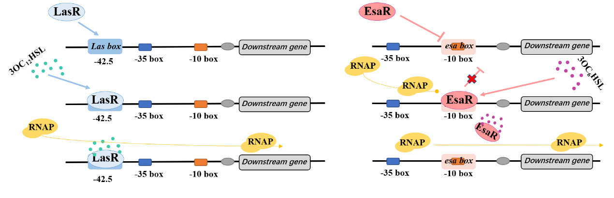

# **Assignment: Designing a Genetic Circuit for Hierarchical Carbon Utilization in *Pseudomonas putida***

## **Background**
Engineered probiotics are emerging as “live biotherapeutics”. Because of complicated interactions in microbial community, a harmless microbe can 
become a pathogen in presence of a specific microbial species or when conditions change. In this case, a therapeutic which is only activated when both 
microbial species is required. Engineering a microbe which produces an anti-microbial agent (e.g., an anti‑biofilm enzyme, a bacteriocin, or a CRISPR‑based kill‑switch) only when a combination of signals is present offers a solution.

In recent years synthetic‑biology tools have made it possible to turn harmless *Escherichia coli* Nissle 1917 (EcN) into a “living drug".
The idea is simple: give the bacterium a genetic circuit, like an electronic circuit, i.e. a set of DNA parts that sense a signal, process it with logical rules (AND, OR, NOT …), and then turn on a therapeutic gene only when the right conditions are met.
Many bacteria communicate with one another by releasing tiny chemical “talkers” called quorum‑sensing (QS) molecules. When a population becomes dense enough, the concentration of the molecule rises and activates a specific regulator protein inside the cells.
Two potential intestinal microorganisms who can become pathogens are *Pseudomonas aeruginosa* and *Yersinia enterocolitica*.
Both use QS molecules: *Pseudomonas aeruginosa* uses the molecule N-3-Oxododecanoyl-homoserine lactone (3OxoC12-AHL, C12) to trigger the activator LasR,
*Yersinia enterocolitica* uses the molecule Homoserine Lactone (C6-AHL, C6), that is sensed by the repressor EsaR (Figure 1).

 **Figure 1** Transcriptional regulation of LasR and EsaR. Figure obtained from Li et al. (2025)

## **Objective**
Your task is to design a genetic circuit that enables EcN to respond produce anti-microbial agents when C12 and C6 are present.
You only have to design the genetic circuit, the gene producing the antimicrobial can is given (DspB, bactericidal peptide).
Your submission will include both a design proposal and a biological rationale.

## **Deliverables**
You must submit the following:

1. **Genetic Circuit Design (Core Requirement)**  
   - Define the logic gates and Boolean logic required for pathway regulation.
   - Sketch a genetic interaction diagram, showing key components (e.g., promoters, regulators, repressors, activators) and their relationships.
   - Explain your choices for the promoter and regulator, justifying how they lead to production of the antimicrobial.

2. **Biological Rationale (Choose ONE of the following):**
   - **Option A: Potential Challenges and Solutions**  
     - Identify at least one key challenge in implementing your genetic circuit (e.g., metabolic burden, leaky expression, unintended cross-regulation).  
     - Propose a possible solution to mitigate this challenge.  
  
   - **Option B: Application of the Circuit**  
     - Describe how your circuit would behave in a real‑world setting (e.g., a mouse gut, a fermenter, a food‑preservation model)
     - Discuss at least two environmental variables (pH, oxygen, substrate availability) and how your design copes with them.

## **Grading Rubric (Total: 10 points)**

| **Category**                 | **Criteria**                                                  | **Points** |
|------------------------------|---------------------------------------------------------------|------------|
| **Genetic Circuit Design**   | Clear and correct truth table, Boolean logic, and logic gates | 1          |
|                              | Logical and minimalistic genetic interaction design           | 1          |
|                              | Justification of promoter and regulator choice                | 1          |
| **Biological Rationale**     | Clear and well-supported discussion of selected option        | 3          |
|      | Plausibility of proposed problem and solution                 | 2          |
| **Clarity and Organization** | Well-structured, concise, and free of major errors            | 1          |
|                              | Clear caption and labels of figures and diagrams              | 1          |

**Total: 10 points**

## **Submission Guidelines**
- Submit a single PDF containing your circuit diagram, logic explanation, and biological rationale.
- Name your PDF: `lastname_firstname.pdf`
- Keep your responses concise (max 1 pages, excluding diagrams).
- Label all components in your figures and tables clearly and provide clear and instructive captions.
- Submit your work in Moodle before the 13th of May 2026

By completing this assignment, you will develop a deeper understanding of logic-based gene regulation and its applications in metabolic engineering. Good luck!

